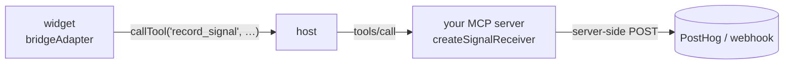

# mcp-signal

[](https://www.npmjs.com/package/mcp-signal)
[](./LICENSE)
[](./package.json)
[](./dist/index.d.ts)

<p align="center">
  
</p>

**Understand how your MCP widgets are actually used.** A tiny, zero-dependency telemetry SDK you
drop into an interactive MCP widget (Claude MCP Apps, ChatGPT Apps SDK, mcp-ui) to capture usage and
forward it to any analytics destination — PostHog, a webhook, your console, or an adapter you write.

```js
import { createSignal, consoleAdapter } from 'mcp-signal';

const signal = createSignal({
  widgetName: 'weather',
  adapters: [consoleAdapter()],
});

signal.track('forecast_expanded', { day: 'tue' });
```

That's a working first event. Swap `consoleAdapter()` for a real destination when you're ready.

---

## Why this exists

MCP servers increasingly ship **interactive widgets** — HTML/JS UI rendered inside a host like Claude
or ChatGPT. If you build one, you're flying blind: does it load? which controls get used? where do
people drop off? what errors happen inside that sandboxed iframe? Regular web-analytics snippets
don't work cleanly in these sandboxes, and there's no standard instrumentation story.

`mcp-signal` fills the gap with three ideas:

- **A pluggable adapter contract.** The core doesn't know about any vendor. You plug in a
  destination; the community can write more. Two ship in v0.1 (PostHog + webhook) plus a console
  adapter for local dev.
- **A transport that actually works in locked-down widgets.** Widgets can't make arbitrary network
  calls (a strict host CSP blocks them). So the recommended transport routes events **through a
  model-invisible MCP tool call** to your own server, which forwards them — no CSP changes, key stays
  server-side. Direct HTTP is available too when you control your widget's CSP.
- **It captures the boring-but-essential stuff for you.** Load/visible/close lifecycle, uncaught
  errors, and (optionally) clicks — with no code — plus a `track()` call for everything else.

It's neutral plumbing: **no phone-home, no collection of its own.** You decide what's sent. See
[Privacy & data](./docs/privacy.md).

---

## Install

```bash
npm install mcp-signal
```

Usable from TypeScript or plain JS. For a raw-HTML (`srcdoc`) widget with no bundler, you can also
inline the standalone build — see [docs/setup.md](./docs/setup.md).

---

## Quickstart

### 1. See your first events (console — 30 seconds)

```js
import { createSignal, consoleAdapter } from 'mcp-signal';

const signal = createSignal({
  widgetName: 'weather',
  widgetVersion: '1.0.0',
  adapters: [consoleAdapter()],
});

// lifecycle + errors are captured automatically. Add your own:
document.querySelector('#expand').addEventListener('click', () => {
  signal.track('forecast_expanded', { day: 'tue' });
});
```

Open the console — you'll see `mcp_signal_loaded` and every `track()` call.

### 2. Ship to a real destination — the bridge (recommended)

The reliable production path routes events through a small **app-only tool** on your MCP server,
which forwards them to PostHog (or anywhere). This works even under the strictest host CSP and keeps
your analytics key server-side.



**In your widget:**

```js
import { createSignal, bridgeAdapter } from 'mcp-signal';

const signal = createSignal({
  widgetName: 'weather',
  adapters: [bridgeAdapter({ toolName: 'record_signal' })],
});
```

**On your MCP server** (register one tool — the package hands you the descriptor):

```js
import { createSignalReceiver, posthogAdapter, signalToolDefinition } from 'mcp-signal/server';

const receiver = createSignalReceiver({
  adapters: [posthogAdapter({ apiKey: process.env.POSTHOG_KEY, host: 'eu' })],
});

const tool = signalToolDefinition(); // app-only, model-invisible, read-only
server.registerTool(tool.name, tool, (args) => receiver.handleToolCall(args));
```

`signalToolDefinition()` sets `_meta.ui.visibility: ["app"]` (the model never sees the tool — zero
context cost) and `readOnlyHint: true` (silent on ChatGPT, first-use-then-remembered on Claude). Full
walkthrough incl. `@modelcontextprotocol/ext-apps`: [docs/setup.md](./docs/setup.md) ·
[docs/bridge.md](./docs/bridge.md).

### 3. Or send direct from the widget (you control the CSP)

```js
import { createSignal, posthogAdapter } from 'mcp-signal';

const signal = createSignal({
  adapters: [posthogAdapter({ apiKey: 'phc_public_key', host: 'eu' })],
});
```

Direct HTTP only leaves the widget if you **allowlist the destination** in your resource's CSP. The
package generates it for you:

```js
import { cspMeta } from 'mcp-signal';
cspMeta([posthogAdapter({ apiKey: 'phc_x', host: 'eu' })]);
// => { ui: { csp: { connectDomains: ['https://eu.i.posthog.com'] } } }
```

See the honest trade-offs in [Limitations](./docs/limitations.md).

---

## What gets captured

| Event                    | When                                            |
| ------------------------ | ----------------------------------------------- |
| `mcp_signal_loaded`      | SDK initializes                                 |
| `mcp_signal_visible`     | widget becomes visible                          |
| `mcp_signal_hidden`      | widget is hidden (also flushes)                 |
| `mcp_signal_closed`      | widget is torn down (`pagehide`)                |
| `mcp_signal_error`       | uncaught error / unhandled rejection            |
| `mcp_signal_interaction` | click on a `[data-mcp-signal]` element (opt-in) |
| _(your name)_            | every `track(name, props)` call                 |

Every event carries a best-effort **context**: widget name/version, an anonymous per-load
`sessionId`, detected host, theme, locale, display mode, timezone, and viewport — only where reliably
obtainable, and never any user identity. See [Privacy & data](./docs/privacy.md).

---

## Try the demo

```bash
git clone https://github.com/Roee-Tsur/mcp-signal
cd mcp-signal
npm install
npm run example        # builds, then serves http://localhost:8787
```

Click around and watch events arrive through **both** transports (webhook + bridge) live, in the page
and in your terminal. See [example/README.md](./example/README.md).

---

## Adapters

| Adapter                              | Package             | Purpose                                  |
| ------------------------------------ | ------------------- | ---------------------------------------- |
| `consoleAdapter()`                   | `mcp-signal`        | Local dev; always works under any CSP    |
| `webhookAdapter({ url })`            | `mcp-signal`        | POST batches to any URL                  |
| `posthogAdapter({ apiKey, host })`   | `mcp-signal`        | PostHog Cloud (US/EU) or self-hosted     |
| `bridgeAdapter({ toolName })`        | `mcp-signal`        | Route via an MCP tool call (recommended) |
| `createSignalReceiver({ adapters })` | `mcp-signal/server` | Server-side counterpart to the bridge    |

Full config for each is in [docs/adapters.md](./docs/adapters.md). Writing your own is a small,
documented contract — see [docs/writing-an-adapter.md](./docs/writing-an-adapter.md).

---

## Configuration

`createSignal(config)` options (all optional):

| Option                         | Default              | Description                                             |
| ------------------------------ | -------------------- | ------------------------------------------------------- |
| `adapters`                     | `[consoleAdapter()]` | Destinations.                                           |
| `widgetName` / `widgetVersion` | —                    | Attached to every event's context.                      |
| `enabled`                      | `true`               | `false` = hard no-op, no listeners attached.            |
| `autoCaptureLifecycle`         | `true`               | Emit loaded/visible/hidden/closed.                      |
| `autoCaptureErrors`            | `true`               | Capture uncaught errors + rejections.                   |
| `autoCaptureInteractions`      | `false`              | `true` or `{ attribute, captureAllClicks, eventName }`. |
| `batchSize`                    | `20`                 | Flush when the queue reaches this.                      |
| `flushIntervalMs`              | `5000`               | Periodic flush; `0` disables.                           |
| `maxQueueSize`                 | `500`                | Drop oldest beyond this (backpressure).                 |
| `requestTimeoutMs`             | `8000`               | Per in-session send timeout.                            |
| `retry`                        | `{maxRetries:3,…}`   | Exponential backoff for in-session sends.               |
| `beforeSend`                   | —                    | `(event) => event \| null` — redact or drop.            |
| `context`                      | —                    | Static properties merged into every event's context.    |
| `sessionId`                    | auto                 | Override the session id.                                |
| `host`                         | auto                 | Override host detection.                                |
| `debug`                        | `false`              | Verbose logs + CSP diagnostics.                         |

The client returned exposes `track()`, `flush()`, `shutdown()`, `setContext()`, `getContext()`,
`queueLength`, and `enabled`.

---

## Privacy & data

The SDK collects nothing on its own and never phones home. It sends exactly what you configure. It
attaches non-invasive context (theme, locale, viewport, an anonymous per-load session id — **no user
identity, no fingerprinting**), which you can trim or redact with `beforeSend`, or disable entirely
with `enabled: false`. **You are responsible for your end users' privacy and applicable law.** Read
the full [Privacy & data](./docs/privacy.md) section before shipping.

---

## Limitations (v0.1, honest)

- **Direct HTTP needs a CSP allowlist.** Widgets are network-restricted by the host; the SDK can't
  self-authorize egress. Use the bridge, or add the domain via `cspMeta()`.
- **Tool-call approval is a host's call.** Read-only tools are silent on ChatGPT and
  first-use-then-remembered on Claude, but the spec lets a host prompt; we can't guarantee zero
  prompts everywhere.
- **Fire-and-forget.** Cross-origin sends can't read responses (that's how they stay CSP-simple), so
  delivery is best-effort with retries + idempotency keys, not confirmed.
- **Host detection is best-effort.** `chatgpt` vs a framed host isn't always distinguishable
  synchronously; pass `host` to override.

Details and workarounds: [docs/limitations.md](./docs/limitations.md).

---

## Roadmap

- A hosted dashboard (data lives in your destination for now).
- More adapters: Segment, Amplitude, GA4, Mixpanel, OpenTelemetry.
- Drop-in tool-registration helpers for popular MCP server frameworks.
- Consent / CMP tooling and PII-scrubbing helpers.
- A durable, cross-load retry queue.
- Richer opt-in auto-capture.

Not in v0.1: a storage/query backend, a dashboard, and server-side MCP telemetry (tool-call/resource
metrics) — widgets only for now.

---

## Contributing

Issues and PRs welcome — see [CONTRIBUTING.md](./CONTRIBUTING.md). The bar for a new adapter: implement
the small contract, stay dependency-free, and pass the contract test.

## License

[MIT](./LICENSE) © 2026 Roee Tsur
